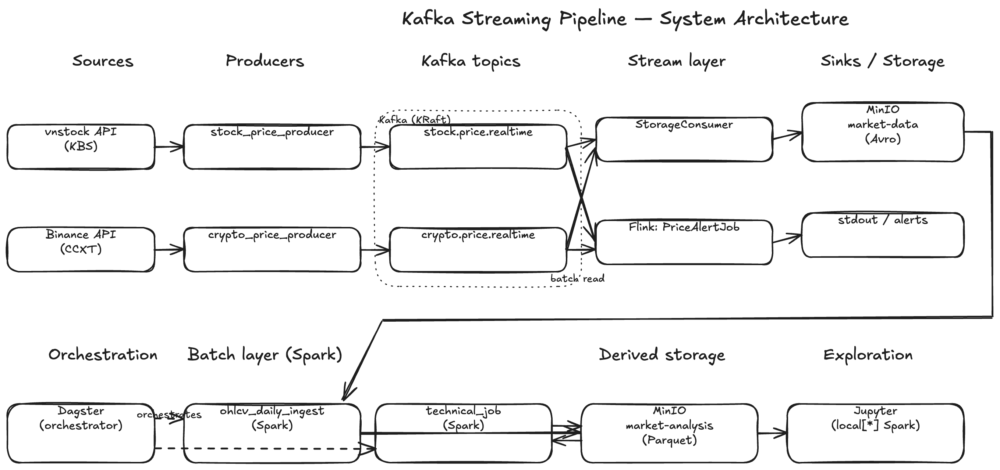

# Design Document — Kafka Streaming Pipeline

A real-time data pipeline for Vietnamese stock and cryptocurrency market data, built on Apache Kafka, MinIO, Apache Flink, Apache Spark, and (Phase 10) Dagster.

This document is the high-level overview. **Each Docker service has its own design doc** in `design/services/`:

- [KAFKA.md](services/KAFKA.md) — broker + UI, listener topology, topic layout, message schema
- [MINIO.md](services/MINIO.md) — bucket layout, lifecycle rules, host vs in-Docker endpoints, the Spark reading rule
- [FLINK.md](services/FLINK.md) — JobManager + TaskManager, the alert job, when to use Flink vs the Python alternative
- [SPARK.md](services/SPARK.md) — master + worker + history server, SparkFactory, JAR pinning, gotchas
- [JUPYTER.md](services/JUPYTER.md) — local[*] mode for ad-hoc exploration, when to escalate to the cluster
- [DAGSTER.md](services/DAGSTER.md) *(Phase 10, implemented)* — asset graph, daily partitions, Spark-as-external-compute, rollout plan

---

## 1. Problem

Both vnstock (Vietnamese equities) and crypto exchanges expose data through **pull-based** APIs. Every downstream script that calls them directly hits the API again — no history, no fanout, no decoupling. Adding a second alerter doubles the upstream load.

Kafka turns the pull into a push pipeline. Producers fetch from the upstream API once and publish to a topic; any number of consumers (storage, alerts, batch jobs, future use cases) read the same stream independently.

---

## 2. Architecture

**Editable source:** [`design/images/architecture.excalidraw`](images/architecture.excalidraw) — open in [excalidraw.com](https://excalidraw.com) (File → Open) or via the [VS Code Excalidraw extension](https://marketplace.visualstudio.com/items?itemName=pomdtr.excalidraw-editor).

**Data flow (left to right, top half is the live stream layer; bottom half is the batch layer):**



Two-tier storage:
- **`market-data`** — raw streaming data (Avro). 30-day lifecycle. Recoverable from upstream APIs.
- **`market-analysis`** — derived data (Parquet). No expiry. Expensive to recompute.

---

## 3. Design Decisions

### 3.1 Why Kafka in the middle?

Decoupling. Adding a new consumer (Flink alerter, ML feature pipeline, dashboard) never increases load on vnstock or Binance — the producers fetch once and the broker fans the data out.

### 3.2 Why split storage into two buckets?

Different lifecycle, different read patterns:
- Raw snapshots are append-only, queried rarely, recoverable from upstream → 30-day expiry is fine.
- Derived data (OHLCV, indicators) is queried analytically and expensive to recompute → no expiry.

Splitting buckets makes the lifecycle policy trivial to express (one rule per bucket) and makes "is this data raw or derived?" obvious from the path.

### 3.3 Why Avro for snapshots, Parquet for OHLCV/indicators?

- **Avro** is row-oriented and embeds its schema — ideal for streaming appends where each record arrives individually.
- **Parquet** is columnar — ideal for analytical reads (e.g. "give me all closing prices for VCB over 200 days") that only need a subset of columns.

The two formats reflect how each layer is used, not arbitrary preference.

### 3.4 Why Flink for alerts?

`analysis/stream/price_alert_job.py` (Flink `KeyedProcessFunction`) is the single alert path. An earlier stateless Python version (`consumers/alert_consumer.py`, Phase 5) was removed once the Flink job covered the same rules — keeping two implementations of the same behaviour added churn without value.

Flink is the right home because future alert patterns (debounce windows, EMAs, volatility bursts) require **per-symbol state**, which a stateless loop can't express cleanly. The shared rule-evaluation function lives in `producers/utils.py::evaluate_rules` so the logic stays unit-testable without a JVM.

### 3.5 Why a standalone Spark cluster instead of local mode?

The batch jobs (`ohlcv_daily_ingest`, `technical_job`) could run in `local[*]` mode just fine. We run a Docker Spark cluster instead to:
1. Mirror a production submission flow (`spark-submit --master ...`).
2. Capture event logs in the Spark History Server (`:18080`).
3. Force the codebase to be cluster-friendly from day one (`spark.executorEnv.*` propagation, no host-only paths).

`SparkFactory` still falls back to `local[*]` for Jupyter and tests via `SPARK_MASTER_URL`. See [services/SPARK.md](services/SPARK.md) §5.

### 3.6 Why derive OHLCV from snapshots rather than re-fetching from the API?

The snapshots in MinIO are already the source of truth for what prices we observed. Re-fetching OHLCV from vnstock/CCXT would create a second lineage that might disagree (different endpoints, different timestamps, missed ticks). Deriving OHLCV from stored snapshots keeps the pipeline self-consistent.

### 3.7 Why partition Kafka topics by symbol?

All ticks for the same asset land on the same partition, preserving per-symbol ordering. Consumers that only care about a subset of symbols can read a single partition. With 6 partitions and replication factor 1, the cluster scales horizontally for symbol load while staying single-node-simple.

### 3.8 Why no OHLCV or financials Kafka topic?

OHLCV is computed by a daily Spark job from already-stored snapshots. Routing it through Kafka would add latency and a second source of truth for one downstream reader. The Spark job writes directly to `market-analysis`. Same reasoning for fundamentals.

### 3.9 Why Dagster (Phase 10)?

Asset-centric orchestration maps onto the existing MinIO directory layout — `price.snapshot → ohlcv.bar → technical.indicators` is already a graph of data assets. Dagster's daily partitions line up 1:1 with the `year=/month=/day=` paths, and backfills are first-class.

Trade-off accepted: smaller community than Airflow. See [services/DAGSTER.md](services/DAGSTER.md) §2 for the full decision and §6 for how Dagster wraps the existing Spark jobs without rewriting them.

---

## 4. Storage Schemas

### `market-data/price.snapshot/...avro` (raw, 30-day lifecycle)

```
asset_class={stock|crypto}/symbol={SYM}/year={Y}/month={M}/day={D}/part-{ts_ms}.avro
```

PriceSnapshot Avro schema:

| Field | Type | Notes |
|---|---|---|
| `time` | string | ISO-8601 UTC timestamp of the tick |
| `symbol` | string | Stock ticker or crypto pair |
| `exchange` | string | HOSE, BINANCE, … |
| `price` | double | Last/close price |
| `change` | double | Absolute price change |
| `pct_change` | double | Percentage change |
| `volume` | long | Accumulated volume |
| `bid` | double | Best bid |
| `ask` | double | Best ask |

### `market-analysis/ohlcv.bar/...parquet` (derived, no expiry)

```
asset_class={stock|crypto}/year={Y}/month={M}/day={D}/part-{ts_ms}.parquet
```

OHLCVBar columns: `time, symbol, exchange, open, high, low, close, volume` (open = first tick of day; close = last tick).

### `market-analysis/technical.indicators/...parquet` (derived, no expiry)

```
year={Y}/month={M}/day={D}/part-*.parquet
```

Latest indicator snapshot per symbol: SMA20/50/200, RSI14, MACD/signal/hist, Bollinger Bands (mid/upper/lower). Indicator values are null-guarded — SMA200 stays null until 200 bars exist.

---

## 5. Kafka Message Envelope

All Kafka messages share one JSON envelope (defined in `schemas/message.py`):

```json
{
  "event_type": "price.snapshot",
  "symbol": "BTC/USDT",
  "exchange": "BINANCE",
  "timestamp": "2026-05-17T10:30:00+00:00",
  "source": "ccxt/binance",
  "payload": {
    "price": 62500.0,
    "change": 1200.0,
    "pct_change": 1.96,
    "volume": 1234567890,
    "bid": 62490.0,
    "ask": 62510.0
  }
}
```

`source` is the only field where stock vs crypto differs (`vnstock/KBS` vs `ccxt/binance`); the payload shape is identical so consumers don't special-case.

---

## 6. Implementation Phases

| Phase | Status | What was built | Concepts learned |
|---|---|---|---|
| 1  | ✅ | Docker Compose (Kafka + MinIO), bucket init, topic creation | Docker multi-service, MinIO S3 API |
| 2  | ✅ | Smoke producer + consumer | Kafka topics, producers, consumers |
| 3  | ✅ | `stock_price_producer` — vnstock polling | Producer loop, serialisation, partition keys |
| 4  | ✅ | `storage_consumer` — Kafka → MinIO Avro | Consumer groups, offset management, Avro |
| 5  | ✅ | `alert_consumer` — stateless Python alerter (superseded by Phase 7, since removed) | Multiple consumer groups |
| 6  | ✅ | `crypto_price_producer` — CCXT/Binance polling | Multi-source ingestion, normalised envelope |
| 7  | ✅ | `PriceAlertJob` — PyFlink DataStream + KeyedProcessFunction | Flink DataStream API, stateful processing |
| 8  | ✅ | `ohlcv_daily_ingest` — Spark Docker cluster, S3A, derive OHLCV | Spark cluster mode, S3A connector |
| 9  | ✅ | `TechnicalJob` — SMA/RSI/MACD/BB over OHLCV Parquet history | Window functions, `applyInPandas` for EMA |
| 10 | ✅ | **Dagster orchestrator** — asset-centric scheduling of batch jobs | Software-defined assets, daily partitions, backfills |
| 11 | 📋 | `DigestJob` — gainers/losers/volume digest | Spark DataFrame rankings |
| 12 | 📋 | `ScreenerJob` — P/E, D/E, EPS filter | Spark join/filter, config-driven thresholds |
| 13 | 📋 | `VolatilityBurstJob` — Flink sliding window + ValueState | Flink sliding windows |

---

## 7. Out of Scope (Intentional)

- **Schema registry** — plain JSON is sufficient to learn core concepts
- **Multi-broker Kafka cluster** — single broker is functionally identical from the application's perspective
- **WebSocket feeds** — CCXT REST polling is simpler and sufficient
- **Cloud deployment** — everything runs locally via Docker; the architecture maps cleanly to AWS MSK + S3 + EMR
- **Multi-tenant orchestration / Dagster Cloud** — SQLite-backed Dagster is enough for Phase 10
- **Slack/email alert delivery** — alerts go to stdout; routing comes later

---

## 8. References

- Service-specific design docs: `design/services/`
- Test strategy: [TEST.md](TEST.md)
- Architecture source: [`images/architecture.excalidraw`](images/architecture.excalidraw)
- Planning backlog: [SUGGESTION.md](SUGGESTION.md)
