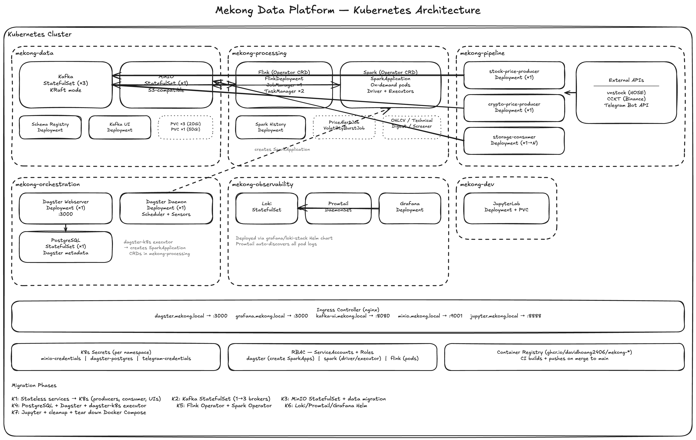

# Kubernetes Migration Plan

> Status: planning — nothing below should be implemented until a phase is selected and scoped.
> Last updated: 2026-05-26

---

## 1. Motivation

Docker Compose runs everything on one host with no fault tolerance, no horizontal scaling, no rolling deploys. Moving to Kubernetes gives us:

- **Self-healing**: crashed pods restart automatically (vs `restart: unless-stopped` which doesn't survive host reboots cleanly)
- **Horizontal scaling**: scale Spark workers, Flink TaskManagers, Kafka producers independently via `replicas` or HPA
- **Rolling deploys**: zero-downtime updates for stateless services (producers, consumers, Dagster webserver)
- **Secret management**: native Kubernetes Secrets replace `.env` files
- **Resource isolation**: proper CPU/memory limits with eviction guarantees
- **Namespace isolation**: dev/staging/prod on one cluster
- **GitOps-ready**: declarative manifests version-controlled alongside code

---

## 2. Current Service Inventory

### 2.1 Stateful services (require PersistentVolumes)

| Service | Docker Volume | Data criticality | Notes |
|---|---|---|---|
| `kafka` | `kafka_data` | High — topic data, offsets | Single-broker KRaft mode. Move to multi-broker for HA |
| `minio` | `minio_data` | High — raw Avro + derived Parquet | Single-node. Consider MinIO Operator for distributed mode |
| `loki` | `loki_data` | Medium — log history | Replaceable via re-ingestion from promtail |
| `grafana` | `grafana_data` | Low — dashboards (version in code) | Provision dashboards via ConfigMap; data is disposable |
| `dagster-webserver/daemon` | `dagster_storage` | Medium — run history, SQLite | Replace SQLite with PostgreSQL (see §7.1) |
| `spark-history-server` | `spark_logs` | Low — event logs | Shared with spark-master. Can use S3 instead |

### 2.2 Stateless services (Deployments)

| Service | Replicas | Notes |
|---|---|---|
| `schema-registry` | 1 | Stateless — stores schemas in Kafka `_schemas` topic |
| `kafka-ui` | 1 | Web UI, no persistent state |
| `flink-jobmanager` | 1 | Coordinates Flink jobs; checkpoints stored in MinIO/S3 |
| `flink-taskmanager` | 1→N | Horizontally scalable. Currently 8 task slots |
| `spark-master` | 1 | Coordinates Spark cluster |
| `spark-worker` | 1→N | Horizontally scalable. Currently 2G mem, 2 cores |
| `jupyter` | 1 | Dev tool — notebook source mounted from repo |
| `stock-price-producer` | 1 | Long-running daemon |
| `crypto-price-producer` | 1 | Long-running daemon |
| `storage-consumer` | 1 | Long-running daemon (can scale with consumer group) |
| `dagster-webserver` | 1 | Web UI |
| `dagster-daemon` | 1 | Scheduler/sensor daemon — must be singleton |
| `docker-socket-proxy` | 1 | **Eliminated** — K8s replaces Docker exec with `kubectl`/K8s Job API |
| `promtail` | DaemonSet | Runs on every node |

---

## 3. Target Architecture



### 3.1 Namespace strategy

| Namespace | Services | Why isolated |
|---|---|---|
| `mekong-data` | Kafka, Schema Registry, Kafka UI, MinIO | Core data infrastructure — tight RBAC, separate scaling |
| `mekong-processing` | Flink (JM + TM), Spark (master + workers + history) | Compute-heavy — separate resource quotas |
| `mekong-pipeline` | stock-price-producer, crypto-price-producer, storage-consumer | Application workloads — frequent deploys |
| `mekong-orchestration` | Dagster webserver, Dagster daemon, PostgreSQL | Orchestration layer |
| `mekong-observability` | Loki, Promtail, Grafana | Logging/monitoring |
| `mekong-dev` | Jupyter | Dev tooling — optional in prod |

---

## 4. Kubernetes Resource Mapping

### 4.1 Kafka → StatefulSet

```yaml
# k8s/mekong-data/kafka-statefulset.yaml
apiVersion: apps/v1
kind: StatefulSet
metadata:
  name: kafka
  namespace: mekong-data
spec:
  serviceName: kafka-headless
  replicas: 3                    # 3-broker for HA (up from 1)
  selector:
    matchLabels:
      app: kafka
  template:
    spec:
      containers:
      - name: kafka
        image: apache/kafka:4.0.0
        ports:
        - containerPort: 9092    # client
        - containerPort: 29092   # inter-broker
        - containerPort: 9093    # controller
        env:
        - name: KAFKA_NODE_ID
          valueFrom:
            fieldRef:
              fieldPath: metadata.annotations['kafka-node-id']
        resources:
          requests:
            memory: "256Mi"
            cpu: "250m"
          limits:
            memory: "1Gi"
            cpu: "1000m"
        volumeMounts:
        - name: kafka-data
          mountPath: /var/lib/kafka/data
  volumeClaimTemplates:
  - metadata:
      name: kafka-data
    spec:
      accessModes: ["ReadWriteOnce"]
      resources:
        requests:
          storage: 20Gi
```

**Key changes from Docker Compose:**
- 3 replicas (was 1) for fault tolerance
- Per-broker PVC via `volumeClaimTemplates`
- Headless Service for stable DNS: `kafka-0.kafka-headless.mekong-data.svc`
- `KAFKA_CONTROLLER_QUORUM_VOTERS` dynamically built from ordinal indices
- Replication factor bumped to 3 for topics

### 4.2 MinIO → StatefulSet (or MinIO Operator)

Two options:

| Approach | Effort | Result |
|---|---|---|
| Manual StatefulSet (single node) | Low | Same as current — no HA, just K8s-managed |
| MinIO Operator (`kubectl minio`) | Medium | Distributed mode, erasure coding, tenant isolation |

Recommendation: start with single-node StatefulSet, migrate to MinIO Operator in a later phase.

```yaml
# k8s/mekong-data/minio-statefulset.yaml
apiVersion: apps/v1
kind: StatefulSet
metadata:
  name: minio
  namespace: mekong-data
spec:
  serviceName: minio-headless
  replicas: 1
  template:
    spec:
      containers:
      - name: minio
        image: minio/minio:RELEASE.2025-09-07T16-13-09Z
        args: ["server", "/data", "--console-address", ":9001"]
        env:
        - name: MINIO_ROOT_USER
          valueFrom:
            secretKeyRef:
              name: minio-credentials
              key: access-key
        - name: MINIO_ROOT_PASSWORD
          valueFrom:
            secretKeyRef:
              name: minio-credentials
              key: secret-key
        volumeMounts:
        - name: minio-data
          mountPath: /data
  volumeClaimTemplates:
  - metadata:
      name: minio-data
    spec:
      accessModes: ["ReadWriteOnce"]
      resources:
        requests:
          storage: 50Gi
```

### 4.3 Flink → Flink Kubernetes Operator

The [Flink Kubernetes Operator](https://nightlies.apache.org/flink/flink-kubernetes-operator-docs-stable/) is purpose-built for this. Benefits over raw Deployments:

- Native `FlinkDeployment` CRD
- Automatic savepoint on upgrade
- Built-in HA via K8s ConfigMaps

```yaml
# k8s/mekong-processing/flink-deployment.yaml
apiVersion: flink.apache.org/v1beta1
kind: FlinkDeployment
metadata:
  name: mekong-flink
  namespace: mekong-processing
spec:
  image: mekong-flink:latest     # from docker/flink.Dockerfile
  flinkVersion: "v2_0"
  flinkConfiguration:
    execution.checkpointing.interval: "60000"
    state.checkpoints.dir: s3a://market-data/flink-checkpoints/
    fs.s3a.endpoint: http://minio.mekong-data.svc:9000
    fs.s3a.path.style.access: "true"
  serviceAccount: flink
  jobManager:
    resource:
      memory: "1024m"
      cpu: 0.5
  taskManager:
    replicas: 2                  # scalable
    resource:
      memory: "3072m"
      cpu: 1
    taskSlots: 4                 # 4 slots × 2 TMs = 8 total (same capacity)
  job:
    jarURI: local:///opt/project/jobs/price_alert_job.py
    parallelism: 4
```

### 4.4 Spark → Spark Operator or raw Deployments

Two options:

| Approach | Effort | How Dagster submits |
|---|---|---|
| Spark Operator (`SparkApplication` CRD) | Medium | Dagster creates `SparkApplication` CR via K8s API |
| Standalone cluster (StatefulSet master + Deployment workers) | Low | Dagster calls `spark-submit` via `kubectl exec` or K8s Job |

Recommendation: Spark Operator. It manages driver/executor lifecycle natively and eliminates the standing cluster (on-demand pods per job = lower idle cost).

```yaml
# k8s/mekong-processing/spark-application.yaml (template — Dagster creates per run)
apiVersion: sparkoperator.k8s.io/v1beta2
kind: SparkApplication
metadata:
  name: ohlcv-daily-ingest
  namespace: mekong-processing
spec:
  type: Python
  pythonVersion: "3"
  mode: cluster
  image: mekong-spark:latest     # from docker/spark.Dockerfile
  mainApplicationFile: local:///opt/project/batch/ohlcv_daily_ingest.py
  sparkVersion: "4.1.1"
  driver:
    memory: "1g"
    cores: 1
    serviceAccount: spark
  executor:
    instances: 2
    memory: "3g"
    cores: 2
  sparkConf:
    spark.hadoop.fs.s3a.endpoint: http://minio.mekong-data.svc:9000
    spark.hadoop.fs.s3a.path.style.access: "true"
```

### 4.5 Kafka pipeline daemons → Deployments

```yaml
# k8s/mekong-pipeline/stock-price-producer.yaml
apiVersion: apps/v1
kind: Deployment
metadata:
  name: stock-price-producer
  namespace: mekong-pipeline
spec:
  replicas: 1
  selector:
    matchLabels:
      app: stock-price-producer
  template:
    spec:
      containers:
      - name: producer
        image: mekong-kafka:latest
        command: ["python", "main.py", "stock-price-producer"]
        env:
        - name: KAFKA_BOOTSTRAP_SERVERS
          value: kafka-headless.mekong-data.svc:29092
        - name: SCHEMA_REGISTRY_URL
          value: http://schema-registry.mekong-data.svc:8081
        resources:
          requests:
            memory: "64Mi"
            cpu: "50m"
          limits:
            memory: "256Mi"
            cpu: "200m"
```

Same pattern for `crypto-price-producer` and `storage-consumer`. Storage consumer can scale to multiple replicas (Kafka consumer group handles partition assignment).

### 4.6 Dagster → Deployment + K8s executor

**Critical change**: Docker Compose Dagster uses `docker exec` via docker-socket-proxy to submit Spark jobs. In K8s, Dagster uses `dagster-k8s` or `dagster-celery-k8s` to launch jobs as K8s pods.

```yaml
# k8s/mekong-orchestration/dagster-webserver.yaml
apiVersion: apps/v1
kind: Deployment
metadata:
  name: dagster-webserver
  namespace: mekong-orchestration
spec:
  replicas: 1
  template:
    spec:
      containers:
      - name: webserver
        image: mekong-dagster:latest
        command: ["dagster-webserver", "-h", "0.0.0.0", "-p", "3000", "-w", "/opt/dagster/app/workspace.yaml"]
        ports:
        - containerPort: 3000
        env:
        - name: DAGSTER_HOME
          value: /opt/dagster/dagster_home
        - name: DAGSTER_PG_URL
          valueFrom:
            secretKeyRef:
              name: dagster-postgres
              key: url
```

Dagster daemon follows same pattern (singleton Deployment, `replicas: 1`).

### 4.7 Logging → Helm charts

Loki + Promtail + Grafana have official Helm charts that are battle-tested:

```bash
helm repo add grafana https://grafana.github.io/helm-charts
helm install loki grafana/loki-stack -n mekong-observability \
  --set promtail.enabled=true \
  --set grafana.enabled=true
```

Promtail runs as DaemonSet (one per node) automatically.

### 4.8 docker-socket-proxy → Eliminated

Docker-socket-proxy exists solely so Dagster can `docker exec` into spark-master. In K8s:
- Dagster submits Spark jobs via Spark Operator CRD (preferred) or K8s Job API
- No Docker socket access needed
- Service completely removed

---

## 5. Secrets Management

### 5.1 Current state (Docker Compose)

All secrets in `.env`:
- `MINIO_ACCESS_KEY` / `MINIO_SECRET_KEY`
- `TELEGRAM_BOT_TOKEN` / `TELEGRAM_CHAT_ID`
- `JUPYTER_TOKEN`
- (future) `DAGSTER_PG_URL`

### 5.2 K8s Secrets

```yaml
# k8s/secrets/minio-credentials.yaml (NOT committed — applied manually or via sealed-secrets)
apiVersion: v1
kind: Secret
metadata:
  name: minio-credentials
  namespace: mekong-data
type: Opaque
stringData:
  access-key: minioadmin
  secret-key: minioadmin
```

**Secrets strategy by environment:**

| Environment | Approach |
|---|---|
| Local (minikube/kind) | Plain `Secret` YAML (gitignored) |
| Production | Sealed Secrets or External Secrets Operator (AWS Secrets Manager / Vault) |

### 5.3 Cross-namespace secret sharing

MinIO credentials needed by services in `mekong-processing`, `mekong-pipeline`, and `mekong-orchestration`. Options:

1. **Duplicate secrets** per namespace (simple, explicit)
2. **External Secrets Operator** syncs from one source to multiple namespaces
3. **Reflector** controller mirrors secrets across namespaces

Start with option 1. Move to External Secrets Operator in production.

---

## 6. Networking

### 6.1 Internal service discovery

Docker Compose DNS (`kafka:29092`) becomes Kubernetes Service DNS:

| Docker Compose name | K8s Service DNS |
|---|---|
| `kafka:29092` | `kafka-headless.mekong-data.svc.cluster.local:29092` |
| `schema-registry:8081` | `schema-registry.mekong-data.svc:8081` |
| `minio:9000` | `minio.mekong-data.svc:9000` |
| `spark-master:7077` | `spark-master.mekong-processing.svc:7077` |
| `flink-jobmanager:8081` | `mekong-flink-rest.mekong-processing.svc:8081` |
| `dagster-webserver:3000` | `dagster-webserver.mekong-orchestration.svc:3000` |
| `loki:3100` | `loki.mekong-observability.svc:3100` |

### 6.2 Ingress (external access)

```yaml
# k8s/ingress.yaml
apiVersion: networking.k8s.io/v1
kind: Ingress
metadata:
  name: mekong-ingress
  annotations:
    nginx.ingress.kubernetes.io/rewrite-target: /
spec:
  rules:
  - host: dagster.mekong.local
    http:
      paths:
      - path: /
        pathType: Prefix
        backend:
          service:
            name: dagster-webserver
            port:
              number: 3000
  - host: grafana.mekong.local
    http:
      paths:
      - path: /
        pathType: Prefix
        backend:
          service:
            name: grafana
            port:
              number: 3000
  - host: kafka-ui.mekong.local
    http:
      paths:
      - path: /
        pathType: Prefix
        backend:
          service:
            name: kafka-ui
            port:
              number: 8080
  - host: minio.mekong.local
    http:
      paths:
      - path: /
        pathType: Prefix
        backend:
          service:
            name: minio
            port:
              number: 9001
```

### 6.3 Port mapping (Docker Compose → K8s)

All existing host port mappings (`-p 9092:9092`, etc.) become either:
- **Ingress rules** for web UIs (Dagster, Grafana, Kafka UI, MinIO console)
- **NodePort/LoadBalancer** for development access
- **ClusterIP only** for internal-only services (Kafka inter-broker, Spark master)

---

## 7. Prerequisites Before Migration

### 7.1 Dagster PostgreSQL backend (MUST before K8s)

SQLite cannot be shared across pods. Dagster webserver and daemon must share a PostgreSQL database. This is already planned in SUGGESTION.md §2.2.

```yaml
# k8s/mekong-orchestration/postgres-statefulset.yaml
apiVersion: apps/v1
kind: StatefulSet
metadata:
  name: dagster-postgres
  namespace: mekong-orchestration
spec:
  serviceName: dagster-postgres
  replicas: 1
  template:
    spec:
      containers:
      - name: postgres
        image: postgres:16-alpine
        env:
        - name: POSTGRES_DB
          value: dagster
        - name: POSTGRES_USER
          valueFrom:
            secretKeyRef:
              name: dagster-postgres
              key: username
        - name: POSTGRES_PASSWORD
          valueFrom:
            secretKeyRef:
              name: dagster-postgres
              key: password
        volumeMounts:
        - name: pgdata
          mountPath: /var/lib/postgresql/data
  volumeClaimTemplates:
  - metadata:
      name: pgdata
    spec:
      accessModes: ["ReadWriteOnce"]
      resources:
        requests:
          storage: 10Gi
```

### 7.2 Dagster K8s executor

Replace `docker exec` Spark submission with K8s-native:

```python
# dagster workspace.yaml — switch from local to k8s run launcher
run_launcher:
  module: dagster_k8s
  class: K8sRunLauncher
  config:
    service_account_name: dagster
    job_namespace: mekong-processing
    image_pull_policy: IfNotPresent
```

Dagster `pip install dagster-k8s` adds the K8s run launcher and executor.

### 7.3 Container registry

Docker Compose builds images locally. K8s needs a registry:

| Environment | Registry |
|---|---|
| Local (minikube) | minikube built-in registry or `eval $(minikube docker-env)` |
| Local (kind) | `kind load docker-image` |
| Production | GitHub Container Registry (`ghcr.io/davidhoang2406/mekong-*`) |

CI pipeline builds and pushes images on merge to main.

### 7.4 RBAC for Dagster and Spark Operator

Both need permissions to create/delete pods in their target namespaces:

```yaml
# k8s/rbac/dagster-role.yaml
apiVersion: rbac.authorization.k8s.io/v1
kind: Role
metadata:
  name: dagster-job-runner
  namespace: mekong-processing
rules:
- apiGroups: ["batch"]
  resources: ["jobs"]
  verbs: ["create", "delete", "get", "list", "watch"]
- apiGroups: [""]
  resources: ["pods", "pods/log"]
  verbs: ["get", "list", "watch"]
- apiGroups: ["sparkoperator.k8s.io"]
  resources: ["sparkapplications"]
  verbs: ["create", "delete", "get", "list", "watch"]
```

---

## 8. Migration Phases

### Phase K1: Local K8s cluster + stateless services (2–3 days)

**Goal**: Prove the K8s setup works without touching stateful services.

1. Set up local cluster (minikube or kind)
2. Create namespaces
3. Deploy stateless services first:
   - `stock-price-producer` → Deployment
   - `crypto-price-producer` → Deployment
   - `storage-consumer` → Deployment
   - `schema-registry` → Deployment
   - `kafka-ui` → Deployment
4. Keep Kafka and MinIO running in Docker Compose
5. Verify producers connect to Kafka, consumer writes to MinIO
6. Set up Ingress controller (nginx-ingress)

**Validation**: Producers publish to Kafka, storage-consumer writes Avro to MinIO, Kafka UI accessible via Ingress.

### Phase K2: Kafka to K8s (1–2 days)

**Goal**: Move Kafka broker into K8s.

1. Deploy Kafka StatefulSet (single broker first, match current setup)
2. Create topics via K8s Job (replaces `make topics-create`)
3. Update all services to use K8s DNS for Kafka bootstrap
4. Migrate from single broker to 3-broker cluster
5. Update topic replication factor to 3

**Validation**: All producers and consumers work against K8s Kafka. Topic lag stable. No message loss during switchover.

**Rollback**: Point services back to Docker Compose Kafka by changing env vars.

### Phase K3: MinIO to K8s (1 day)

**Goal**: Move MinIO into K8s with data migration.

1. Deploy MinIO StatefulSet
2. Run `mc mirror` from old MinIO to new MinIO (preserves all data)
3. Run `db/init_minio.py` against new MinIO to create buckets + lifecycle rules
4. Update all services to use K8s DNS for MinIO endpoint
5. Verify Spark/Flink can read/write S3A paths

**Validation**: All buckets exist, lifecycle rules applied, existing Parquet/Avro files readable.

### Phase K4: PostgreSQL + Dagster to K8s (2–3 days)

**Goal**: Move orchestration layer.

1. Deploy PostgreSQL StatefulSet
2. Modify `dagster.yaml` to use PostgreSQL backend
3. Install `dagster-k8s` into Dagster image
4. Deploy Dagster webserver + daemon as Deployments
5. Replace `docker exec spark-submit` with Spark Operator `SparkApplication` submission
6. Remove docker-socket-proxy entirely
7. Test: trigger Dagster asset materialization → Spark job runs as K8s pod → writes to MinIO

**Validation**: Dagster UI accessible, daily schedule triggers, Spark jobs complete, sensor monitoring works.

### Phase K5: Flink + Spark to K8s (2–3 days)

**Goal**: Move compute layer.

1. Install Flink Kubernetes Operator (`helm install flink-operator`)
2. Deploy `FlinkDeployment` CR for price alert job
3. Install Spark Operator (`helm install spark-operator`)
4. Convert Dagster Spark submission to create `SparkApplication` CRDs
5. Remove standing Spark cluster (master+worker) — Spark Operator manages on-demand
6. Deploy Spark History Server (reads event logs from S3/MinIO)

**Validation**: Flink alert job running, checkpoint recovery works, Spark jobs submitted by Dagster complete successfully.

### Phase K6: Observability to K8s (1 day)

**Goal**: Move logging stack.

1. Deploy Loki + Promtail + Grafana via Helm charts
2. Promtail auto-discovers all pod logs via K8s API
3. Import existing Grafana dashboards via ConfigMap provisioning
4. Verify log aggregation from all namespaces

**Validation**: Logs from all services visible in Grafana, Loki queries work.

### Phase K7: Jupyter + cleanup (1 day)

**Goal**: Move dev tooling, tear down Docker Compose.

1. Deploy Jupyter as Deployment with notebook PVC
2. Set up Ingress for Jupyter (with auth)
3. Remove all Docker Compose services
4. Update `Makefile` with K8s equivalents (`kubectl` / `helm` commands)
5. Update CI pipeline to build+push images to container registry
6. Update all design docs to reflect K8s architecture

**Validation**: Full platform running on K8s. Docker Compose used only as historical reference.

---

## 9. Directory Structure

```
mekong-infra/
├── k8s/
│   ├── mekong-data/
│   │   ├── namespace.yaml
│   │   ├── kafka-statefulset.yaml
│   │   ├── kafka-headless-service.yaml
│   │   ├── kafka-service.yaml
│   │   ├── kafka-topics-job.yaml
│   │   ├── schema-registry-deployment.yaml
│   │   ├── schema-registry-service.yaml
│   │   ├── kafka-ui-deployment.yaml
│   │   ├── kafka-ui-service.yaml
│   │   ├── minio-statefulset.yaml
│   │   ├── minio-headless-service.yaml
│   │   ├── minio-service.yaml
│   │   └── minio-init-job.yaml
│   ├── mekong-processing/
│   │   ├── namespace.yaml
│   │   ├── flink-deployment.yaml          # FlinkDeployment CRD
│   │   ├── spark-history-deployment.yaml
│   │   └── spark-history-service.yaml
│   ├── mekong-pipeline/
│   │   ├── namespace.yaml
│   │   ├── stock-price-producer-deployment.yaml
│   │   ├── crypto-price-producer-deployment.yaml
│   │   └── storage-consumer-deployment.yaml
│   ├── mekong-orchestration/
│   │   ├── namespace.yaml
│   │   ├── postgres-statefulset.yaml
│   │   ├── postgres-service.yaml
│   │   ├── dagster-webserver-deployment.yaml
│   │   ├── dagster-webserver-service.yaml
│   │   ├── dagster-daemon-deployment.yaml
│   │   └── dagster-configmap.yaml         # dagster.yaml + workspace.yaml
│   ├── mekong-observability/
│   │   ├── namespace.yaml
│   │   └── values-loki-stack.yaml         # Helm values override
│   ├── mekong-dev/
│   │   ├── namespace.yaml
│   │   ├── jupyter-deployment.yaml
│   │   └── jupyter-service.yaml
│   ├── rbac/
│   │   ├── dagster-role.yaml
│   │   ├── dagster-rolebinding.yaml
│   │   ├── spark-role.yaml
│   │   ├── spark-rolebinding.yaml
│   │   ├── flink-role.yaml
│   │   └── flink-rolebinding.yaml
│   ├── secrets/                           # gitignored — never committed
│   │   ├── minio-credentials.yaml
│   │   ├── dagster-postgres.yaml
│   │   └── telegram-credentials.yaml
│   └── ingress.yaml
├── docker/                                # Dockerfiles remain — images are the same
│   ├── flink.Dockerfile
│   ├── spark.Dockerfile
│   ├── dagster.Dockerfile
│   ├── kafka.Dockerfile
│   └── jupyter.Dockerfile
├── docker-compose.yml                     # preserved for local-only dev fallback
└── Makefile                               # extended with k8s-* targets
```

---

## 10. Makefile Targets (K8s equivalents)

```makefile
# ── Kubernetes targets ───────────────────────────────────────────────────────

KUBECTL := kubectl
HELM    := helm

k8s-namespaces: ## Create all namespaces
	$(KUBECTL) apply -f k8s/mekong-data/namespace.yaml
	$(KUBECTL) apply -f k8s/mekong-processing/namespace.yaml
	$(KUBECTL) apply -f k8s/mekong-pipeline/namespace.yaml
	$(KUBECTL) apply -f k8s/mekong-orchestration/namespace.yaml
	$(KUBECTL) apply -f k8s/mekong-observability/namespace.yaml
	$(KUBECTL) apply -f k8s/mekong-dev/namespace.yaml

k8s-secrets: ## Apply secrets (files must exist in k8s/secrets/ — not committed)
	$(KUBECTL) apply -f k8s/secrets/

k8s-rbac: ## Apply RBAC roles and bindings
	$(KUBECTL) apply -f k8s/rbac/

k8s-data-up: ## Deploy Kafka + MinIO + Schema Registry
	$(KUBECTL) apply -f k8s/mekong-data/

k8s-processing-up: ## Deploy Flink + Spark
	$(KUBECTL) apply -f k8s/mekong-processing/

k8s-pipeline-up: ## Deploy producers + consumer
	$(KUBECTL) apply -f k8s/mekong-pipeline/

k8s-dagster-up: ## Deploy Dagster + PostgreSQL
	$(KUBECTL) apply -f k8s/mekong-orchestration/

k8s-logging-up: ## Deploy Loki stack via Helm
	$(HELM) upgrade --install loki grafana/loki-stack \
		-n mekong-observability \
		-f k8s/mekong-observability/values-loki-stack.yaml

k8s-up: k8s-namespaces k8s-secrets k8s-rbac k8s-data-up k8s-processing-up k8s-pipeline-up k8s-dagster-up k8s-logging-up

k8s-status: ## Show pod status across all mekong namespaces
	$(KUBECTL) get pods -l app.kubernetes.io/part-of=mekong --all-namespaces

k8s-down: ## Delete all mekong resources (PVCs preserved)
	$(KUBECTL) delete -f k8s/mekong-pipeline/ --ignore-not-found
	$(KUBECTL) delete -f k8s/mekong-processing/ --ignore-not-found
	$(KUBECTL) delete -f k8s/mekong-orchestration/ --ignore-not-found
	$(KUBECTL) delete -f k8s/mekong-data/ --ignore-not-found
	$(HELM) uninstall loki -n mekong-observability --ignore-not-found
```

---

## 11. Dagster Integration Changes

The biggest code change is how Dagster submits Spark jobs.

### 11.1 Current (Docker Compose)

```python
# Dagster uses docker exec to submit Spark jobs
docker_client.exec_create("spark-master", f"spark-submit --master spark://spark-master:7077 ...")
```

### 11.2 Target (Kubernetes)

```python
# Option A: dagster-k8s run launcher — each asset run is a K8s Job
from dagster_k8s import k8s_job_executor

@job(executor_def=k8s_job_executor)
def ohlcv_pipeline():
    ohlcv_daily_bars()

# Option B: Spark Operator — Dagster creates SparkApplication CRDs
from kubernetes import client as k8s_client

def submit_spark_job(job_name, main_file, args):
    api = k8s_client.CustomObjectsApi()
    spark_app = {
        "apiVersion": "sparkoperator.k8s.io/v1beta2",
        "kind": "SparkApplication",
        "metadata": {"name": job_name, "namespace": "mekong-processing"},
        "spec": {
            "type": "Python",
            "mode": "cluster",
            "image": "mekong-spark:latest",
            "mainApplicationFile": main_file,
            "arguments": args,
            # ... driver/executor config
        }
    }
    api.create_namespaced_custom_object(
        group="sparkoperator.k8s.io",
        version="v1beta2",
        namespace="mekong-processing",
        plural="sparkapplications",
        body=spark_app,
    )
```

Option B (Spark Operator) preferred — gives fine-grained control over each job's resources.

---

## 12. CI/CD Pipeline

```yaml
# .github/workflows/build-push.yml
name: Build and Push Images
on:
  push:
    branches: [main]
    paths:
      - 'docker/**'

jobs:
  build:
    runs-on: ubuntu-latest
    strategy:
      matrix:
        image:
          - { name: mekong-flink,   dockerfile: docker/flink.Dockerfile }
          - { name: mekong-spark,   dockerfile: docker/spark.Dockerfile }
          - { name: mekong-dagster, dockerfile: docker/dagster.Dockerfile }
          - { name: mekong-kafka,   dockerfile: docker/kafka.Dockerfile }
          - { name: mekong-jupyter, dockerfile: docker/jupyter.Dockerfile }
    steps:
      - uses: actions/checkout@v4
      - uses: docker/login-action@v3
        with:
          registry: ghcr.io
          username: ${{ github.actor }}
          password: ${{ secrets.GITHUB_TOKEN }}
      - uses: docker/build-push-action@v6
        with:
          context: .
          file: ${{ matrix.image.dockerfile }}
          push: true
          tags: ghcr.io/davidhoang2406/${{ matrix.image.name }}:${{ github.sha }}
```

---

## 13. Local Development Strategy

K8s doesn't replace Docker Compose for local dev — it augments it.

| Scenario | Tool |
|---|---|
| Quick iteration on a single service | Docker Compose (keep `docker-compose.yml`) |
| Full platform integration test | Local K8s cluster (minikube/kind) |
| Production deployment | Managed K8s (EKS/GKE/AKS) |

Docker Compose remains the fastest way to `make up` and iterate. K8s manifests target staging/production.

---

## 14. Cost & Resource Summary

### 14.1 Minimum local cluster (minikube/kind)

| Resource | Requirement |
|---|---|
| CPU | 8 cores |
| Memory | 16 GB |
| Disk | 100 GB |

This matches current Docker Compose requirements plus K8s control plane overhead (~1 GB).

### 14.2 Production cluster estimate (managed K8s)

| Node pool | Count | Instance | Purpose |
|---|---|---|---|
| System | 1 | 2 vCPU / 4 GB | K8s control plane, Ingress, observability |
| Data | 1–2 | 4 vCPU / 16 GB | Kafka brokers, MinIO, PostgreSQL |
| Compute | 1–3 (autoscaling) | 4 vCPU / 16 GB | Spark jobs, Flink tasks |
| Pipeline | 1 | 2 vCPU / 4 GB | Producers, consumers, Dagster |

---

## 15. Risks and Mitigations

| Risk | Impact | Mitigation |
|---|---|---|
| Data loss during Kafka migration | High | Run old and new Kafka in parallel. Mirror topics with MirrorMaker 2. Cut over only after lag = 0 |
| MinIO data loss during migration | High | `mc mirror` with `--preserve` flag. Verify checksums. Keep old MinIO running until verified |
| Dagster SQLite → PostgreSQL migration | Medium | Dagster CLI has `dagster instance migrate`. Test on copy of storage first |
| Flink checkpoint incompatibility | Medium | Take savepoint before migration. Restore from savepoint on K8s Flink |
| Increased complexity | Medium | Phase the migration. Keep Docker Compose as fallback. Don't migrate everything at once |
| RBAC misconfiguration | Medium | Start with permissive RBAC in dev, tighten incrementally. Test each permission |
| Cross-namespace networking issues | Low | K8s DNS is automatic. Test connectivity with `kubectl run` debug pods |

---

## 16. Decision Log

| Decision | Choice | Alternative considered | Why |
|---|---|---|---|
| K8s distribution (local) | minikube | kind, k3s, Docker Desktop K8s | Best docs, widest adoption, LoadBalancer support via `minikube tunnel` |
| K8s distribution (prod) | TBD — EKS or GKE | Self-managed | Managed control plane, integrated IAM, less ops burden |
| Manifest format | Raw YAML | Helm charts, Kustomize | Simpler to understand, version, and review. Helm only for third-party (Loki, operators) |
| Flink deployment | Flink K8s Operator | Raw Deployments | CRD handles savepoints, HA, upgrades natively |
| Spark deployment | Spark Operator | Standing cluster | On-demand pods per job = lower idle cost, cleaner resource management |
| Dagster Spark integration | Spark Operator CRD via K8s API | `kubectl exec`, K8s Job | Operator manages driver/executor lifecycle, retries, event logs |
| Secret management (dev) | Plain K8s Secrets (gitignored) | Sealed Secrets | Simplest for local dev |
| Secret management (prod) | External Secrets Operator | Sealed Secrets, Vault sidecar | Native integration with cloud secret stores |

---

## 17. Open Questions

1. **Managed K8s provider**: EKS vs GKE vs AKS? Depends on cloud preference and cost.
2. **Helm vs raw YAML for mekong services**: Raw YAML for now (simpler), but Helm templates would help if we need dev/staging/prod value overrides.
3. **GitOps tooling**: ArgoCD or Flux for declarative deploys? Not needed until production.
4. **Spark Operator vs standing cluster**: Operator is recommended but requires learning the CRD lifecycle. Standing cluster is simpler to start with.
5. **MinIO Operator vs StatefulSet**: MinIO Operator gives distributed mode + erasure coding but adds complexity. When does data volume justify it?
